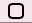

# StatusThing - Configurable Status Icon for OS X

Inspired by <a href="https://github.com/tonsky/AnyBar">AnyBar</a>, StatusThing is a network-addressable, JSON configurable icon that lives on your OS X status bar.


```sh
$ telnet localhost 55000
Trying ::1...
telnet: connect to address ::1: Connection refused
Trying 127.0.0.1...
Connected to localhost.
Escape character is '^]'.
Connected to ThingStatus
Feed Me JSON
{ "shape":"circle","color":"white","symbol":"\u018F","symbolColor":"black" }
^]
telnet> q
```


```sh
$ telnet localhost 55000
Trying ::1...
telnet: connect to address ::1: Connection refused
Trying 127.0.0.1...
Connected to localhost.
Escape character is '^]'.
Connected to ThingStatus
Feed Me JSON
{ "color":"red","symbolColor":"yellow" } }
^]
telnet> q
```


## Features
- Listens for client TCP connections (port 55000 by default)
- Clients can send JSON dictionaries to change the appearance of the icon:
  - shape
  - color
  - symbol
  - symbol color, font and font size
  - short update messages
  - hide and show shape, outline and symbol


### Shapes
Shapes are rendered on the fly, making ThingStatus resolution independent.  Clients can also toggle the shape outline to get that extra level of customization.

  -  circle 
  -  triangle
  - square
  - roundedsquare
  - diamond
  - pentagon
  - hexagon
  - octogon
  - star
  - cross
  - strike

Future Feature: Animation

### Symbols

Client supplied symbol displayed in center of status icon. Want to send a Unicode character? No problem! Want it drawn in Purple? No problem!

### Messages

Future Feature: Client supplied short messages to help give context to changes in status.

# JSON

ThingStatus hopes you will send it well-formed JSON dictionaries. It will complain silently to itself and ignore ill-formed JSON dictionaries until I teach it better manners.  Each line sent is expected to be a complete JSON dictionary, so no embedded newlines or carriage returns.  Multiple dictionaries can be sent, or you can send one big dictionary.  When you are done, shutdown your side of the socket and call it a day.

Dictionaries control the attributes of three main elements in StatusThing: shape, outline and symbol.

### Shapes

```sh
{ "shape":"circle|barredCircle|square|roundedSquare|diamond|pentagon|hexagon|octogon" }
```

Ok, barredCircle. It's sort of weird looking, but I'm hoping when I get to the animating and rotating this can be turned into the more familiar circle with a slash through it. 

Broken or debugging shapes include; star, cross, strike.  Use at your own risk, don't say I didn't warn you.

### Colors
```sh
{"fillColor|strokeColor|foregroundColor":"colorName"}
{"fillColor|strokeColor|foregroundColor":{ "red":float,"green":float,"blue":float,"alpha" }}
```

- fillColor: the color used to fill whichever shape you choose.
- strokeColor: color used to outline the shape
- foregroundColor: color used to fill the symbol

Colors can be specified as dictionaries of RGBA values, missing values are interpreted as 0. RGBA values should vary between 0.0 and 1.0.  If they are > 1, I will assume you are expressing the color using a range of numbers between 0 and 255 and scale the number to a float between 0 and 1.  I probably should default alpha to 1, so for now the color dictionary should have a minimum of two items in it: a color:number pair and a 'alpha':number pair.

Colors can also be specified by name.  The more common names are support, as are "banana" and "strawberry" and all the crayonbox color names.

Of course, if an element is hidden changing it's color won't be immediately apparent.

### Toggling Element Visibility
```sh
{"shape.hidden":0|1}
{"outline.hidden":0|1}
{"symbol.hidden":0|1}
```

Sending a number one will hide the specified element and a zero un-hides it.  Sending it a string '1' or '0' will not accomplish what you think should happen. Yet. 

### Symbol Text and Attributes
```sh
{"text":"Your text here but only the first two characters will likely show"}
{"font":"fontName"}
{"fontSize":float}
```

The font for the symbol text is given by name, stuff like 'Courier', 'Helvetica Bold', 'Super Made-up Font Light Italic'.

The fontSize is specified in points and frankly the symbol positioning code is really unsatisfactory and disappointing. My advice is to keep it between 12 and 12 for now.


## Bindings

Planned client bindings are:
- python
- AppleScript
- Anything that can open a TCP connection and send JSON-formatted strings!

### Planned Features

See the <a href="https://github.com/JnyJny/StatusThing/blob/master/StatusThing/TODO">TODO</a> file for a more comprehensive list of planned features.

